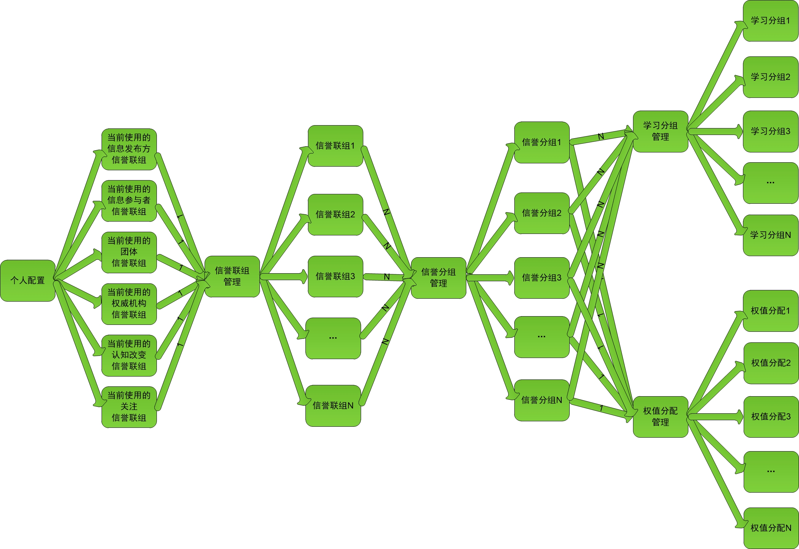

人工学习之系统功能实现要点
==================================================================
***在本章节适合人工学习系统实现者阅读，请结合[《人工学习之互联网广播式信息传播的信息审判者》（加长版）](.)进行阅读***

为了方便统一管理，暂时先将的信息提供者的信誉级别划分为11个级别，正负向各5个级别，还剩1个级别主要是用于忽略计算。信息参与者针对信息的评论级别与信息发布方针对信息的推荐级别也划分为11个级别，正负向各5个级别。  
+  信息提供者的公开信息的历史可查询（包括修改/伪删除历史，伪删除是平台认为信息参与者的信息作恶或者其他原因做了删除级别标记与并注明原因，实际还是存在且可查看的，也防止平台作恶）  
+  可按多种属性和不同时间段为信息提供者设置多个信誉级别，有其提供的信息链接做为证明  
+  有多个信誉级别学习分组，一个学习分组表示一种学习方式，比如自己的信任程度不同的多个学习分组和从别人处学习过来的学习分组  
+  根据信任程度不同可建立多个权值分配，包含信誉级别对应的信誉权值，推荐级别对应的权值系数，评论级别对应的权值系数，权值大小=信誉级别权值\*级别权值系数  
+  有多个信誉分组，包含多个有优先级权值的学习分组与其对应的权值分配  
+  有多个信誉联组，包含多个有优先级权值的信誉分组，一个信誉联组即是一个领域视角判断信息是否有价值及价值的高低，可根据信息提供者类型限定信誉联组的使用范围  
+  一个固定和多个可切换的配置树，各领域及其子孙领域都可组成树状结构，每个节点都可有相对应的信誉联组，当未设置时也可允许是否向父祖级获取对应的信誉联组配置，可随时切换到不同的配置树，以及可同时用多个配置树以不同视角分析查看信息的价值高低，优先从固定配置树获取信誉联组    
+  可快速单个或者多个启用/禁用信誉联组，学习分组，信誉分组  
+  如前面所述的多层次信息分组，有所有信息的分组，有为信息未命中分组的信息分组，并支持一键多层次信息分组跳转，多层次信息分组视图显示与分享  
+  有多种信息评论显示方式，比如公开，朋友，信息评论者，信息发布方，后台管理者，仅自己，信誉级别，按加密授权等或者多种组合  
+  自定义关键字组过滤功能，避免某些信息污染眼睛，自定义关键字组过滤分组下再分组需要反过滤功能  
+  自定义关键字组分组功能  
+  关键字有多个词语组合才生效的功能，支持通配符和正则表达式  
+  有学习功能，包括配置树，信誉级别，权值分配，信誉分组，信誉联组，自定义关键字组等信息的学习，以及学习更新提醒功能  
+  有学习的同步功能，方便亲戚朋友之间进行同步学习  
+  关注学习功能，关注信息参与者针对某个或者某些信息的某些评论级别，根据其评论级别一键批量学习设置其信誉级别  
+  增加某类信息的属性，比如可信度，认可度，厌恶度，难易度等  
+  可按属性对信息进行查询，排序，过滤，筛选等操作  
+  多种信息展示方式，比如引用层次展示，非引用层次链接展示，楼层讨论回帖展示  
+  可自定义醒目的方式（信息与信息提供者）标识信息的价值高低，有可学习功能  
+  多种方式奖励使得信息提供者积极对信息价值的高低做出自己评价与证明  
+  支持团体/权威机构等对信息价值的高低的评价与证明，也采用信誉权值的方式来管理  
+  累加信誉权值多种计算方式（主要是防止捣蛋的信息参与者），正向权值\*X+负向权值\*Y，X与Y在多种计算方式中可为不同值，与多种图表相结合更明朗的显示分析信息价值高低  
+  因某些利益法律问题需要对信息提供者的保护问题，比如提供关键字替换功能  
+  信息的关键字功能，方便快速定位信息，避免标题党浪费时间，感情和精力  
+  后台的奖惩管理功能也可采用信誉权值的方式来管理，比如优先通过处理符合管理理念的高举报信誉权值者的举报，忽略捣蛋的低举报信誉权值者的举报，需考虑小号发垃圾信息大号举报的行为为迅速通过其对低XX信誉权值者的举报并且不奖励，警告或者惩罚其举报行为  
+  账户因为隐私问题，根据后台管理的XX信誉权值可有多个标识的匿名角色  
+  给予信息发布方管理信息的功能，包括提供对信息参与者的评级，警告等，以便为其他信息参与者（特别是新参与进来的信息参与者）一个参考，提供针对该信息多个多层次信息分组视图分享  
+  设立认知改变区（推荐级别与评论级别的改变，也通过设置信誉联组的方式），因对事物的认知是不断改变的，认知改变区反应了信息提供者对于信息的最新的认知，认知改变的历史可见性  

  
根据信息所在的领域，从配置树对应的节点获取其对应的信誉联组，综合考虑从信誉联组中获取信息提供者的信誉权值数据：

+   信誉联组中信誉分组的优先级  
+   信誉分组中学习分组的优先级  
+   学习分组中信誉级别大小，属性，和时间段的优先级  

根据信息提供者的属性与其信息的属性，从自定义的多个个人使用习惯（比如优先使用负向信誉级别，优先使用日期最接近的信誉级别，优先使用信誉级别较高的信誉级别，优先使用限定条件多的信誉级别等）与设定的各层级的优先级，找出最佳的符合限定条件的信誉级别与其对应的权值分配  

***为了避免各大平台之间互相扯皮，平台可对可能需要授权的信息按时间做链式的哈希摘要，平台（或者大授权平台）为账号的每一个角色提供链式的可替换的非对称加密转载授权***  

[*返回主页*](.)
------------------------------------------------------------------